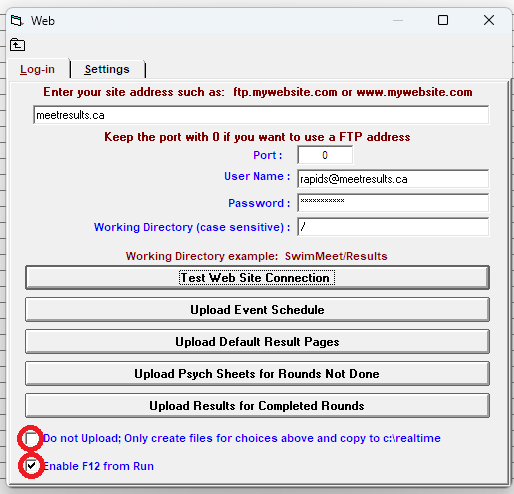
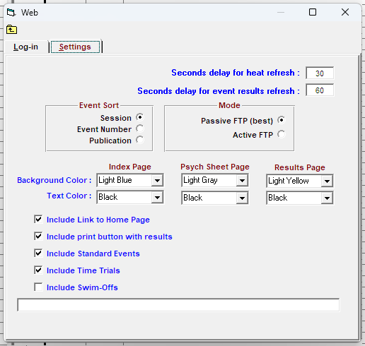

# Admin Desk & Chief Recorder Notes — West Coast Open 2024
## Table of Contents
1. [Web Live Results Set-Up](#lrsetup)
2. [Web Live Results Usage](#lrusage)
   - [Before the Meet / After Creation of Any New Events](#beforemeet)
   - [Before the Session / After Any Changes to Psych Sheet](#beforesession)
   - [After Every Event (Chief Recorder)](#afterevent)
3. [Check Before Printing Psych & Heat Sheets (Para Exception Codes)](#paraexcep)
## Instructions for Web Live Results Set-Up 
**To be checked by the Chief Recorder EVERY TIME HyTek Meet Manager is started or restarted.**
1. From the Meet Manager application Home Page, from the Menu Bar click `Run` to open the "Run the Meet" window.  
2. While in the "Run the Meet" window, from the Menu Bar click `Preferences` > `Web Real-Time` to open the "Web Real-Time Preferences" window.  
   a. Ensure the following settings are selected, then click "Close" to save & close.  
      **IMPORTANT: Ensure that "Generate XML" is UNCHECKED**!  
   

   
   

3. While in the "Run the Meet" window, from the Menu Bar click `Web` to open the "Web Log-In/Settings" window.  
   a. Enter the parameters on the left into the "Log-In" tab:  
   
  
      
      |                   |                         | 
      |              ---: |         :----:          |
      | Site Address      | `meetresults.ca`        |
      | Port              | `0`                     |
      | User Name         | `rapids@meetresults.ca` |
      | Password          | `Rapids@2024`           |
      | Working Directory | `/`                     |  
   

   
   b. Ensure that "Do Not Upload" is UNCHECKED and "Enable F12" is CHECKED.  
   c. Ensure that the "Settings" tab is configured as below:
   - "Event Sort" = "Session"
   - "Mode" = "Passive FTP (best)"
   - Verify colours & checkboxes (If there are swim-offs at the meet, check "Include Swim-Offs")
  
   

       
   

4. Once all settings are properly configured, return to the "Web" > "Log-In" tab and click "Test Web Site Connection".
   - If settings are properly configured, a pop-up should appear saying "Connection to Site Successful."
   - Click `OK` to close the pop-up, then click the `X` at the top right to close the window and return to the "Run the Meet" screen.
   - If a different pop-up appears with an error, return to [Web Live Results Set-Up](#lrsetup) and ensure parameters are properly configured. Ensure all parameters from Step 3a are correct, and ensure that XML generation is disabled.
## Instructions for Web Live Results Usage 
**1. Prior to the meet and after any new events are created (e.g. Swim-Offs, Time Trials), do the following:** 
   - If not already done, configure Live Results by following the instructions under [Web Live Results Set-Up](#lrsetup).
   - While in the "Run the Meet" window, from the Menu Bar click `Web` to open the "Web Log-In/Settings" window.
   - Click "Upload Event Schedule". Wait for the pop-up that says "Event Schedule Web pages successfully uploaded." Click "OK" to close the pop-up.
   - If a different pop-up appears with an error, return to [Web Live Results Set-Up](#lrsetup) and ensure parameters are properly configured. Ensure XML generation is disabled.
   - If all events have been seeded, click `Upload Default Result Pages.` Do not click this if the meet is not yet seeded.
   - Click the `X` at the top right to close the window and return to the "Run the Meet" screen.  

**2. At the beginning of the session or after any changes to the Psych Sheet, do the following:** 
   - If not already done, configure Live Results by following the instructions under [Web Live Results Set-Up](#lrsetup).
   - While in the "Run the Meet" window, from the Menu Bar click `Web` to open the "Web Log-In/Settings" window.
   - Click "Upload Psych Sheets for Rounds Not Done", then select "All Events", or your desired session. Click `OK` to upload, then wait for the pop-up that says "X Psych Sheet html files uploaded."
   - Click `OK` to close the pop-up, then click the `X` at the top right to close the window and return to the "Run the Meet" screen.
   - If a different pop-up appears with an error, return to [Web Live Results Set-Up](#lrsetup) and ensure parameters are properly configured. Ensure XML generation is disabled.  

**3. At the end of every EVENT, or if changes (e.g. DQs) have been made to an already-completed event, do the following:** 
   - While in the "Run the Meet" window, select your Session by clicking the `Session : F7` button in the Lower Menu. 
   - While still in the "Run the Meet" window with your desired Session selected, navigate to a completed event by clicking an event in the Event List on the left half of the screen.
   - Press the `F12` key (or `Fn + F12`, depending on your computer) to push results of a completed event to Live Results.
   - Alternatively, to re-push all results:
      - While in the "Run the Meet" window, from the Menu Bar click `Web` to open the "Web Log-In/Settings" window.
      - Click `Upload Results for All Completed Rounds`, then select "All Events" or your desired session. Click `OK` to upload, then wait for the pop-up that says "X Result html files uploaded."
      - Click `OK` to close the pop-up, then click the `X` at the top right to close the window and return to the "Run the Meet" screen.
      - If a different pop-up appears with an error, return to [Web Live Results Set-Up](#lrsetup) and ensure parameters are properly configured. Ensure XML generation is disabled.
    
## Check Before Printing Heat Sheets or Psych Sheets (Including Para Exception Codes) 
- Prior to the competition, the Meet Secretary should have [included Para Exception Codes in the "2nd Club" field](https://www.swimming.ca/content/uploads/2021/01/Hytek-Meet-Management-Software-Para-Swimming-Nov2020.pdf) for Para Athletes in the "Athletes" menu.
- From the Meet Manager application Home Page, from the Menu Bar navigate to `Setup` > `Report Preferences` to open the "Report Preferences" window.
- Ensure that "Show 2nd Club with primary team" is checked.
- Click `OK` to save and close the "Report Preferences" window.
- Print Psych Sheets and/or Heat Sheets as normal.

   

